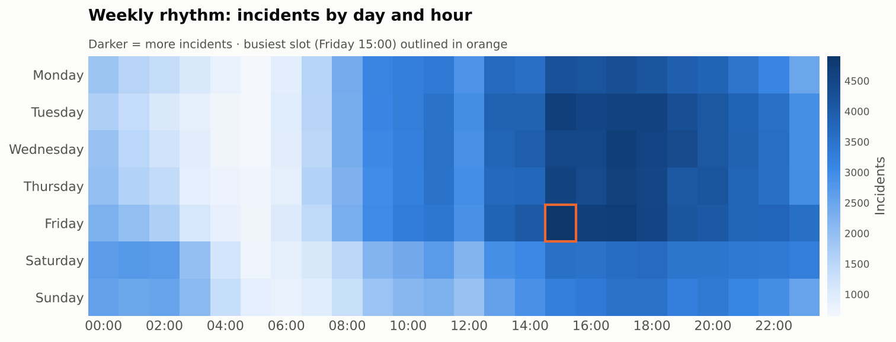
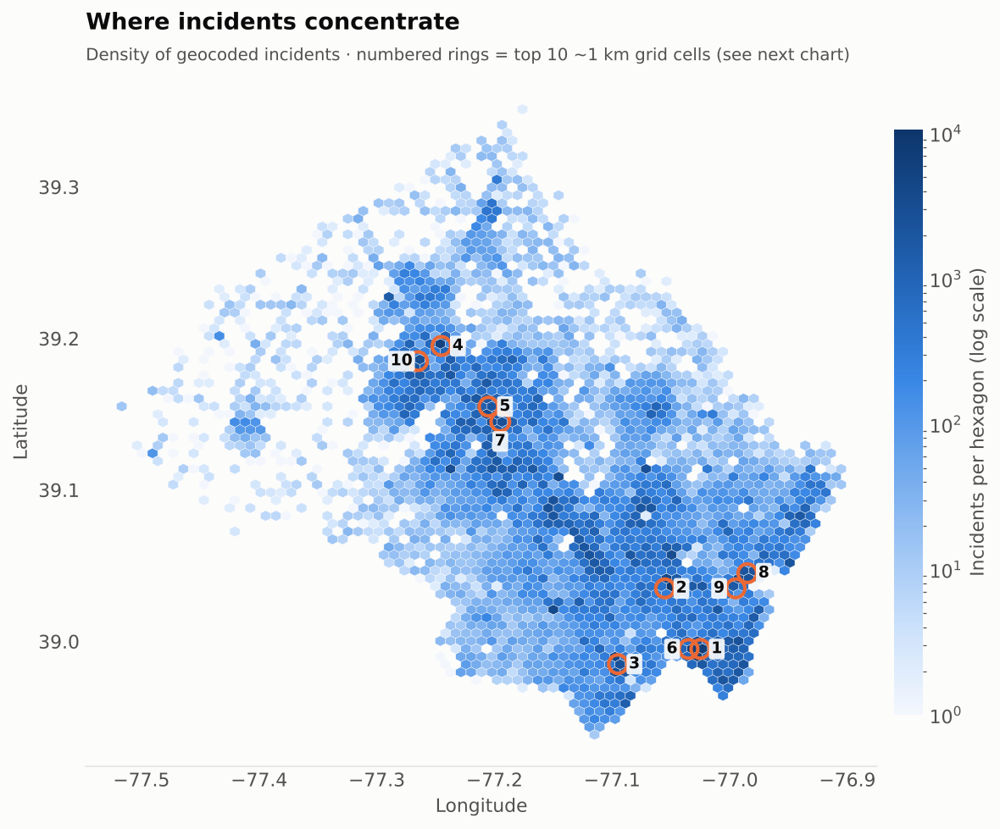
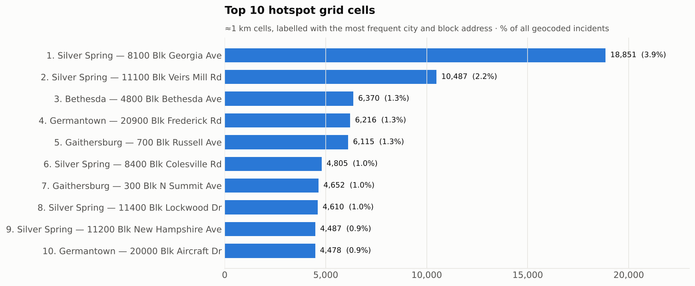
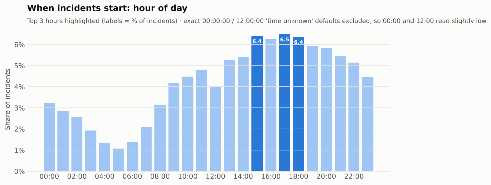
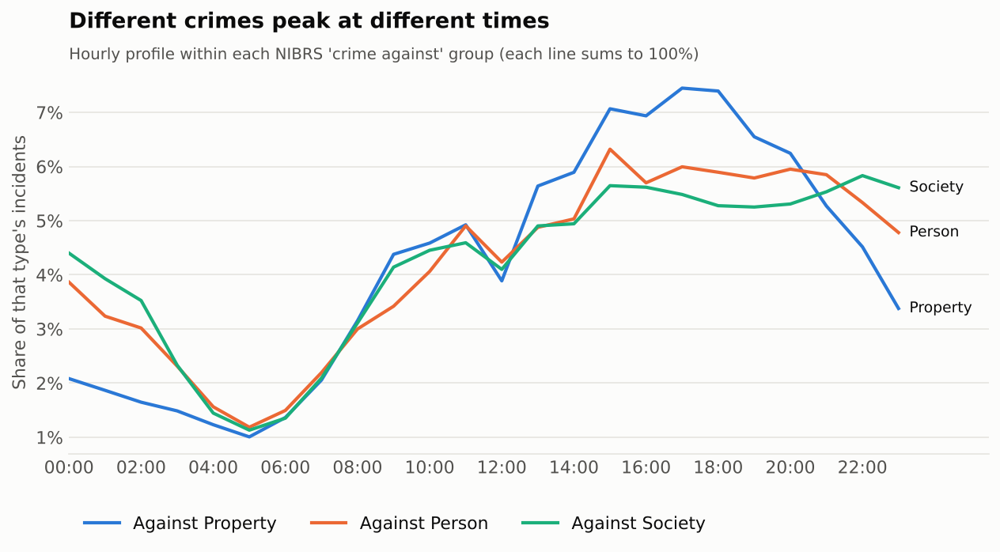
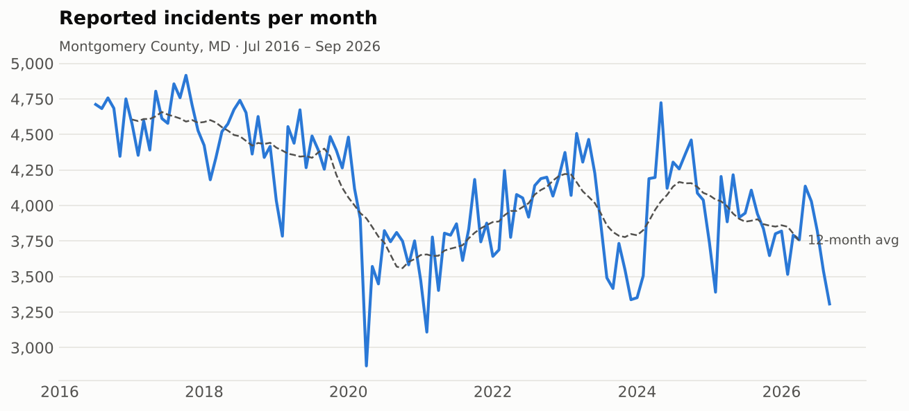
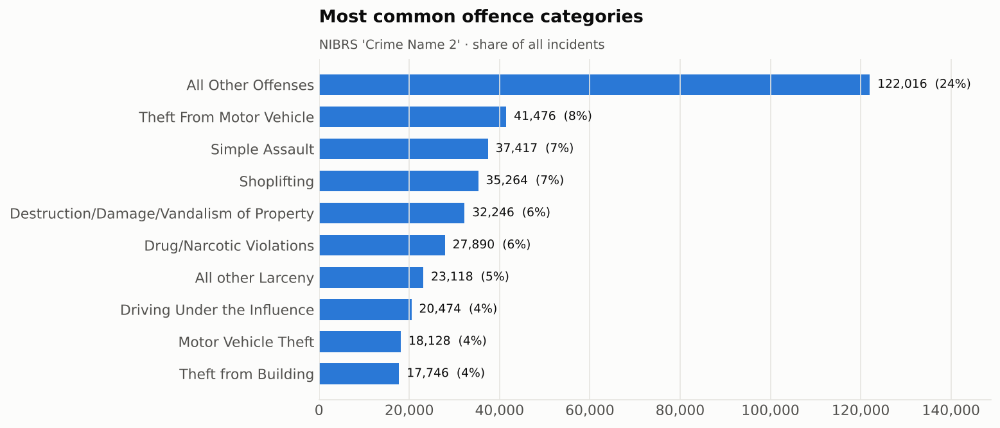

# 🚓 Montgomery County Crime Statistics Analysis


A reusable **Python cleaning pipeline** and **exploratory data analysis** of more than 500,000 crime records published by Montgomery County, Maryland (July 2016 to October 2026). The project answers two questions:

1. **Where** are the high-density crime hotspots?
2. **When** do incidents peak?



---

## 📌 Highlights

| | |
|---|---|
| ⚡ **88% faster data prep** | The pipeline cleans the full 510,898-row extract in **8.6 s**, against **70 s** for a typical ad-hoc notebook approach. Re-loading the cached output takes **0.1 s**. ([benchmark](#-benchmark)) |
| 🧠 **67% less memory** | 250 MB → 83 MB, from column pruning and categorical dtypes |
| 🧹 **Real data-quality fixes** | 293 city spellings collapsed to 46 places, 25,106 bad coordinates removed, 8,456 swapped start/end times corrected, 8.1% "time unknown" placeholder times flagged |
| 📍 **Hotspots** | The densest **5% of ~1 km grid cells contain 45% of all geocoded crime**. Downtown Silver Spring alone accounts for 3.9%. |
| 🕔 **Peak hours** | Crime peaks at **15:00–18:00**, the busiest slot is **Friday 15:00**, and the quietest hour is 05:00 (6× lower than the peak) |

---

## 🗂️ Repository structure

```
montgomery-crime-analysis/
├── src/crime_pipeline/        # the reusable package
│   ├── config.py              # source-specific settings (aliases, formats, bounds, city list)
│   ├── pipeline.py            # CleaningPipeline: runs steps, times them, writes a quality report
│   ├── cleaning.py            # 14 vectorised, idempotent cleaning steps
│   ├── io.py                  # fast loading (pyarrow, usecols) + Parquet caching
│   └── analysis.py            # reusable EDA aggregations (hotspots, peak hours, ...)
├── scripts/
│   ├── download_data.py       # fetch the raw extract
│   ├── run_pipeline.py        # raw CSV -> clean Parquet + data_quality_report.json
│   ├── make_figures.py        # all charts, interactive map, findings.json
│   └── benchmark.py           # ad-hoc notebook cleaning vs pipeline
├── notebooks/
│   └── montgomery_crime_eda.ipynb   # narrated, fully executed analysis
├── tests/test_cleaning.py     # 12 pytest unit tests on a messy fixture
├── reports/
│   ├── figures/               # PNG charts used below
│   ├── hotspot_map.html       # interactive heat-map (download & open in a browser)
│   ├── benchmark.json · data_quality_report.json · findings.json
└── data/                      # raw/processed data (git-ignored, see "How to run")
```

---

## 🧹 The reusable cleaning pipeline

Each cleaning step is a small function `DataFrame -> DataFrame`. Every step is **vectorised** (no row-by-row `.apply`), **idempotent** (safe to re-run) and **unit-tested**. `CleaningPipeline` chains the steps and logs rows in/out, run time and a note for each one. It also saves a JSON data-quality report.

```python
from crime_pipeline import CleaningPipeline, CORE_STEPS, compose, load_raw

pipe = CleaningPipeline(CORE_STEPS)
clean = pipe.run(load_raw("data/raw/Crime.csv"))
pipe.report_frame()                       # per-step audit trail

# extend it without touching the core code
pipe = CleaningPipeline(compose(CORE_STEPS, [my_custom_step]))
```

**What makes it reusable:** everything specific to this extract is in `config.py`: column aliases, datetime formats, the county bounding box and the list of canonical place names. A new monthly extract, a renamed column or another county's open-data feed needs a config change, not new code.

### Pipeline steps and what they found in the real data

| # | Step | Result on the 510,898-row extract |
|---|---|---|
| 1 | `standardize_columns` | Maps any header spelling to canonical snake_case and keeps the 20 needed columns (out of 30) |
| 2 | `drop_exact_duplicates` | 0 exact duplicates (each row is one offence) |
| 3 | `parse_datetimes` | Explicit formats (no slow per-row guessing); 0 unparseable start dates |
| 4 | `drop_missing_start` | 0 rows dropped |
| 5 | `fix_time_order` | **8,456** records where end < start were swapped back |
| 6 | `clean_text_fields` | Trims whitespace, unifies case, turns blanks/"NULL" into NA |
| 7 | `standardize_cities` | **Fuzzy-matches 293 distinct spellings to 46 real places** (e.g. `SILVER SRING`, `GAITHESBURG`, `GERMATOWN`). Matching runs once per distinct value, not per row, so it costs 0.1 s |
| 8 | `flag_non_crimes` | **6,213** NIBRS "Crime Against Not a Crime" records flagged and excluded from the analysis |
| 9 | `clean_zip_codes` | ZIP+4 values cut to 5 digits; 19 invalid values set to NA |
| 10 | `validate_coordinates` | **25,106** rows (4.9%) with 0/missing or out-of-county coordinates set to NA |
| 11 | `coerce_numeric` | Nullable integer types |
| 12 | `add_time_features` | Year, month, weekday, hour, time band and report lag, plus a **placeholder-time flag** (see below) |
| 13 | `add_hotspot_cell` | Snaps coordinates to a 0.01° (~1 km) grid for density analysis |
| 14 | `optimise_dtypes` | Text columns → `category`: memory **188 MB → 83 MB** |

> **Data-quality catch: "time unknown" defaults.** 41% of records starting in the 12:00 hour are logged at *exactly* 12:00:00, compared with a typical ~24% for other hours. Midnight shows the same pattern. Both are default values used when the real time is unknown (e.g. a theft discovered the next morning). Left in, they create a fake "noon peak": the naive analysis says 12:00 is the busiest hour, when the real peak is 15:00–18:00. The pipeline flags these 8.1% of records and leaves them out of the time-of-day analysis only.

---

## ⚡ Benchmark

`scripts/benchmark.py` compares the pipeline with the way this data is typically cleaned in a one-off notebook: default `read_csv` (all 30 columns, type inference), `to_datetime` without a format, and row-wise `.apply()` for city, ZIP and coordinate fixes. Both produce the same 510,898 rows. Times are the median of 3 runs.

| | Ad-hoc notebook | Pipeline (first run) | Pipeline (cached Parquet) |
|---|---:|---:|---:|
| Time | 69.95 s | **8.57 s** (−88%) | **0.12 s** (−99.8%) |
| Memory | 249.8 MB | **83.0 MB** (−67%) | 83.0 MB |

Most of the saving comes from removing row-wise `.apply()`, reading only the needed columns with the pyarrow engine, and caching the cleaned output, which makes every later analysis session almost instant. Results: [`reports/benchmark.json`](reports/benchmark.json).

---

## 📊 Key findings

*504,685 offences, July 2016 – October 2026 (non-crime records excluded)*

### 📍 Where: crime is highly concentrated



- **The densest 5% of occupied ~1 km grid cells contain 44.6% of all geocoded crime.** The top 10 cells alone hold 14.8%.
- **Downtown Silver Spring (8100 block of Georgia Ave)** is the single largest hotspot: 18,851 incidents, or 3.9% of the county. That is 1.8× the next cell.
- Most of the top cells are **retail and commercial corridors**. Shoplifting is the most common offence in the #2 (Veirs Mill Rd, Wheaton), #4 (Frederick Rd, Germantown) and #5 (Russell Ave, Gaithersburg) cells.
- By police district, **Silver Spring (21%) and Wheaton (18.5%)** together account for almost 40% of incidents.



> An interactive, zoomable version of the map is in [`reports/hotspot_map.html`](reports/hotspot_map.html). Download it and open it in a browser.

### 🕔 When: afternoons and Fridays



- Incidents climb from a low at **05:00** to a plateau between **15:00 and 18:00**, peaking at **17:00 (6.5%)**. The peak hour is **6× busier** than the quietest one.
- **Afternoon (12–17) and evening (18–23) account for 67%** of incidents with a known time. Overnight (00–05) accounts for only 13%.
- **Friday is the busiest day** and **Sunday the quietest**. The busiest single slot of the week is **Friday 15:00**.
- Weekends own the small hours: **40% of incidents between 00:00 and 04:00 happen on Saturday or Sunday**, against 29% if crime were spread evenly across the week.



- **Each type of crime has its own clock.** Property crime peaks at **17:00** and falls away sharply at night. Crimes against persons peak at **15:00**. Crimes against society (drugs, DUI, weapons) peak at **22:00** and stay high overnight, which likely reflects evening enforcement activity such as traffic stops.

### 📈 Trend and mix



- Reported crime was highest in 2017 (55,672 offences). It fell to about 44,500 a year in 2020–2021, during the pandemic, and has settled at 46,000–50,000 a year since.
- **"All Other Offenses" (24%)** is the biggest category. After that come theft from motor vehicles (8.2%), simple assault (7.4%) and shoplifting (7.0%).



### 💡 What this could mean for resource planning

1. **Targeted patrols**: almost half of all crime happens in 5% of the county's area, so concentrating presence on those cells, especially retail corridors, gives the most coverage per officer-hour.
2. **Shift alignment**: staffing peaks should cover 15:00–19:00, with Friday as the heaviest day. Evening and overnight weekend shifts matter most for crimes against society.
3. **Data quality at source**: 8% placeholder times and 293 spellings of 46 place names point to easy wins in the records-management system, such as drop-down city fields and an explicit "time unknown" flag.

---

## 🚀 How to run

```bash
git clone https://github.com/<your-username>/montgomery-crime-analysis.git
cd montgomery-crime-analysis
python -m venv .venv && source .venv/bin/activate
pip install -r requirements.txt

# 1. get the data (~160 MB) – or download it in a browser and save it as data/raw/Crime.csv
python scripts/download_data.py

# 2. clean it -> data/processed/crime_clean.parquet + reports/data_quality_report.json
python scripts/run_pipeline.py data/raw/Crime.csv

# 3. analysis: figures, interactive map, findings.json
python scripts/make_figures.py

# 4. optional: benchmark and tests
python scripts/benchmark.py data/raw/Crime.csv
pytest
```

Or open [`notebooks/montgomery_crime_eda.ipynb`](notebooks/montgomery_crime_eda.ipynb) for the narrated walk-through.

---

## 📚 Data source and limitations

**Source:** [Montgomery County, MD Open Data portal: *Crime*](https://data.montgomerycountymd.gov/Public-Safety/Crime/icn6-v9z3) (dataset `icn6-v9z3`). Each row is one offence reported to Montgomery County Police and partner agencies, classified under NIBRS. The raw file is not committed (it is about 160 MB), so download it with the script above.

**Limitations**
- This is **reported** crime only. Under-reporting varies by offence type and area.
- 4.9% of records have no usable coordinates and are left out of the hotspot analysis.
- Times are often rounded or defaulted. Placeholder times (8.1%) are excluded from time-of-day charts, so 00:00 and 12:00 slightly under-count genuine incidents at those exact times.
- A block address with very high counts can also reflect where reports are made (transit hubs, malls, stations), not only where offences happen.
- Hotspots are counts, not rates: busy commercial areas have more people present, so they are not "more dangerous" per visitor.
- Records cover July 2016 to early October 2026. The latest month is partial and is left out of trend charts.

---

## 🛠️ Skills demonstrated

`Python` · `pandas` · `NumPy` · `pyarrow / Parquet` · `data cleaning pipelines` · `fuzzy matching` · `performance optimisation` · `unit testing (pytest)` · `EDA` · `geospatial density analysis` · `matplotlib` · `folium` · `Jupyter`

## 👤 Author

**Illiyin Sakhawat**: [LinkedIn](https://www.linkedin.com/in/illiyin-sakhawat)
